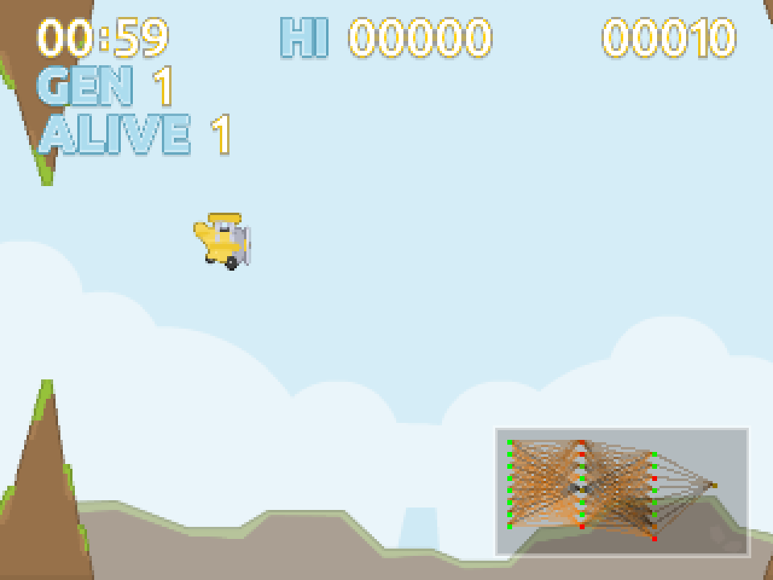
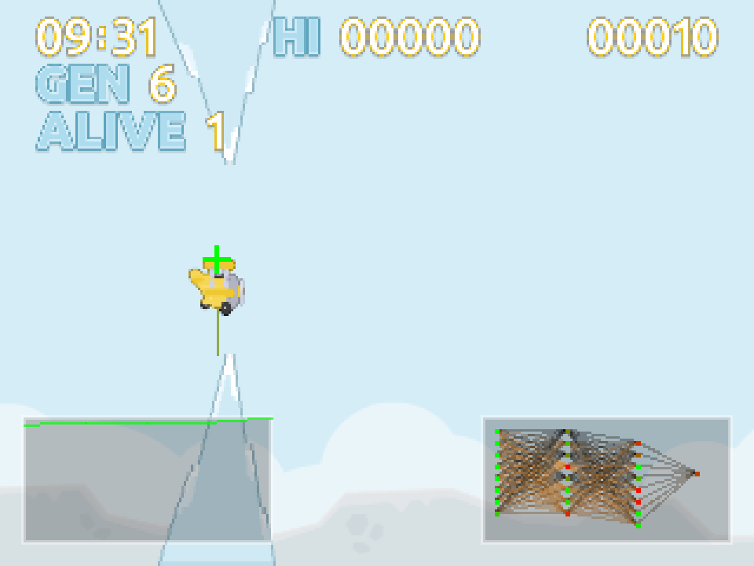
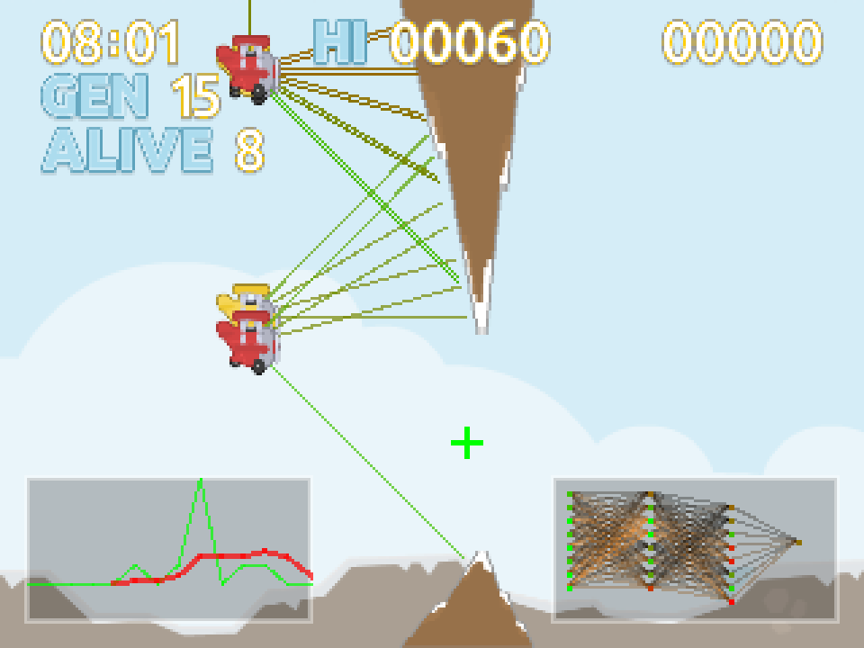
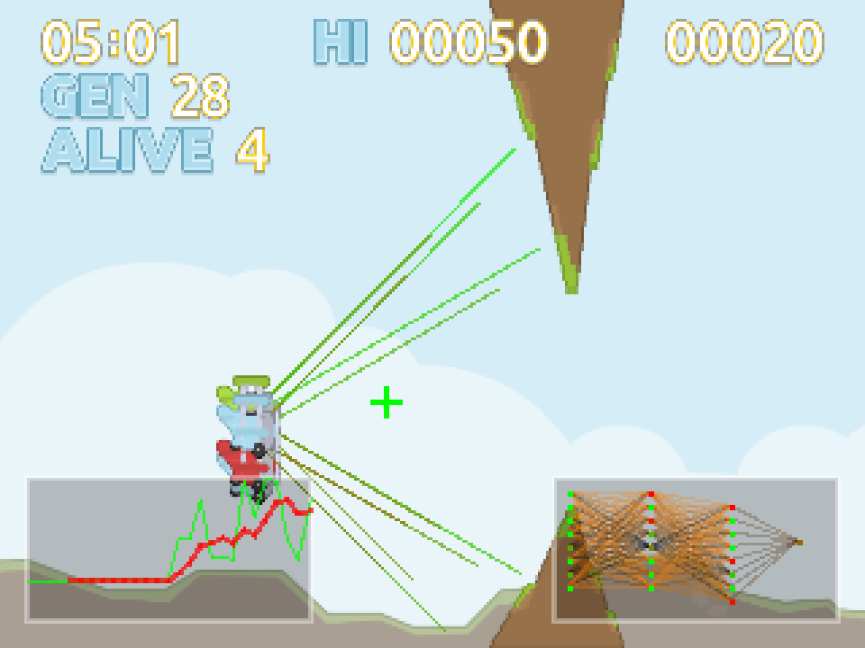
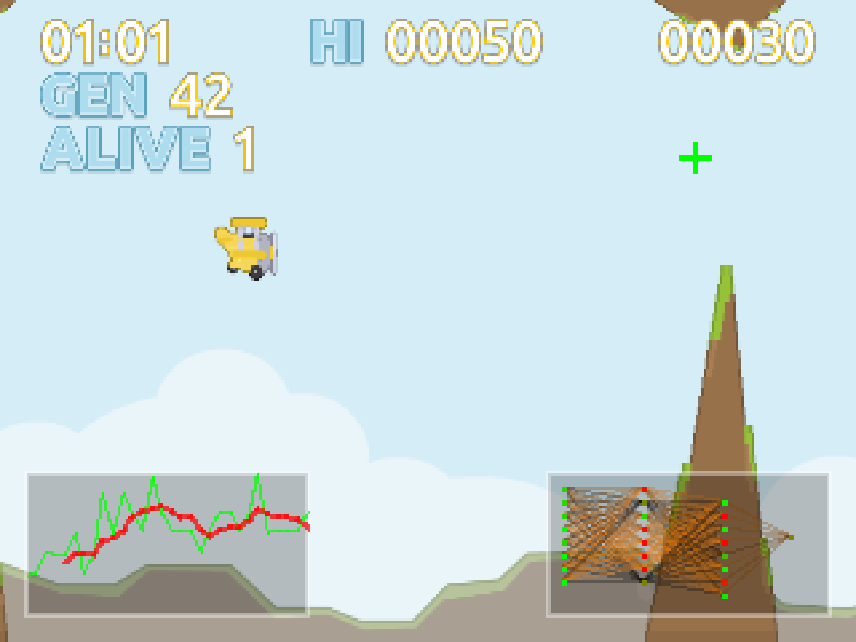
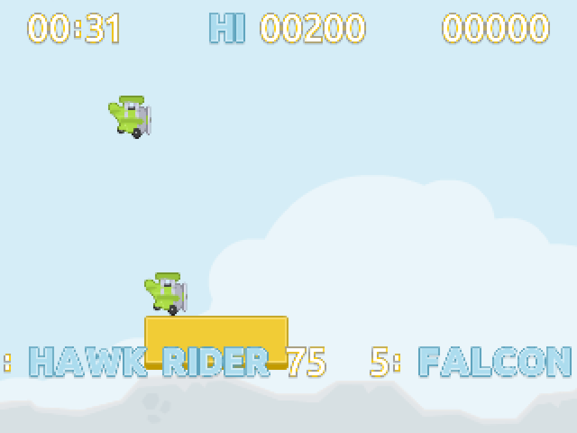
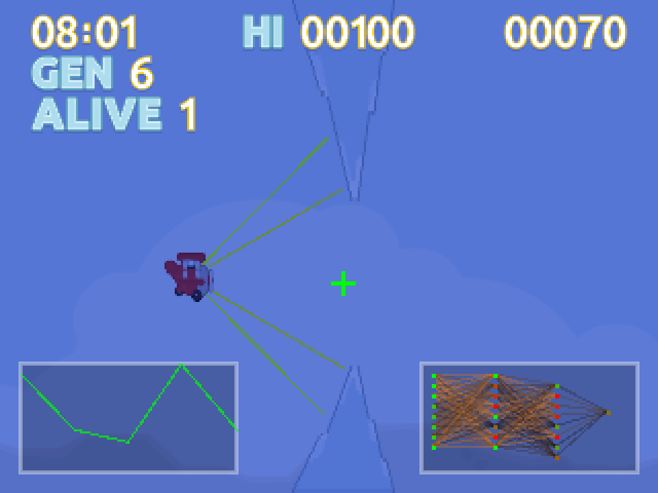

# Pomodoro Pilot

A Pomodoro timer with an integrated Flappy Bird-style game to keep you focused during work sessions.



## Quick Start

### Requirements
- Java 17 or higher

### Download and Run

**Windows:**
1. Download [PomatoTimer.jar](release/PomatoTimer.jar)
2. Double-click the JAR file to run with default settings (25 min work, 5 min break)
3. Or run from Command Prompt with custom times:
   ```cmd
   java -jar PomatoTimer.jar
   ```

**macOS/Linux:**
```bash
# Download and run with default settings
java -jar release/PomatoTimer.jar

# Custom work/break times (in minutes)
java -jar release/PomatoTimer.jar 50 10
```

**Command Line Options:**
```bash
# Work time and break time in minutes
java -jar PomatoTimer.jar <work_minutes> <break_minutes>

# Examples:
java -jar PomatoTimer.jar 25 5   # 25 min work, 5 min break
java -jar PomatoTimer.jar 50 10  # 50 min work, 10 min break
```

## How to Play

### Game Modes

**Work Phase (AI Mode)**
- The game starts with AI controlling the plane using neural networks and genetic algorithms
- Watch multiple AI planes learn to navigate through obstacles automatically
- Press **A** to toggle between AI learning mode and classic mode
- Press **T** to enable turbo mode for faster AI training
- Press **R** to visualize the AI's raycast sensors (color-coded by distance)
- The AI demonstrates optimal gameplay and evolves over generations

**Work Phase (Manual Mode)**
- Press **SPACE** to take control and jump
- Navigate through mountain obstacles
- Avoid hitting the top/bottom of the screen
- Each obstacle passed earns 10 points
- Game ends on collision or falling off screen

**Break Phase**
- Relax and watch planes fly across the screen
- View the scrolling high score table
- Prepare for the next work session

### Controls

- **SPACE** - Jump (take manual control during work phase)
- **T** - Toggle turbo mode (fast rendering for AI training)
- **B** - Toggle background rendering on/off
- **F** - Toggle fullscreen mode
- **R** - Toggle raycast visualization on/off
- **N** - Toggle neural network visualization on/off
- **A** - Toggle between AI learning mode and classic mode
- **Click anywhere** - Show/hide Skip and Exit buttons

### Features

- **AI Learning Mode**: Neural network-powered planes that learn through genetic algorithms
- **Neural Network Visualization**: Real-time display of the best plane's brain activity with color-coded activation levels
- **Fitness Graph**: Track AI learning progress over generations with moving average
- **Turbo Mode**: Press 'T' for accelerated AI training while timer runs in real time
- **Raycast Visualization**: Press 'R' to see AI sensor data with distance-based color coding
- **Dynamic Difficulty**: Obstacles increase every 3 seconds, spawn rate accelerates
- **Day/Night Cycle**: Randomly switches between day and night modes every 15 seconds with smooth 5-second transitions
- **High Score Table**: Top 5 scores are saved and displayed
- **Random Elements**: Unique pilot names, varied terrain (Grass/Ice/Snow), different plane colors
- **Landing Sequence**: Plane lands on platform in final 5 seconds of work phase

## Running the Game

### Basic Usage

```bash
java -jar PomatoTimer-1.0-SNAPSHOT-jar-with-dependencies.jar
```

Uses default settings: 25 minutes work, 5 minutes break

### Command Line Options

```bash
java -jar PomatoTimer-1.0-SNAPSHOT-jar-with-dependencies.jar <work_minutes> <break_minutes>
```

**Examples:**

```bash
# 5 minute work, 1 minute break
java -jar PomatoTimer-1.0-SNAPSHOT-jar-with-dependencies.jar 5 1

# 1 minute work, 1 minute break (testing)
java -jar PomatoTimer-1.0-SNAPSHOT-jar-with-dependencies.jar 1 1

# 50 minute work, 10 minute break
java -jar PomatoTimer-1.0-SNAPSHOT-jar-with-dependencies.jar 50 10
```

## Building from Source

```bash
mvn clean package
```

The compiled JAR will be in `target/PomatoTimer-1.0-SNAPSHOT-jar-with-dependencies.jar`

## Game Mechanics

### Difficulty Progression

- **Obstacle Count**: Starts with 2, increases by 1 every 3 seconds (no limit)
- **Spawn Rate**: Starts at 120 frames between spawns, reaches maximum speed (24 frames) in 30 seconds
- **Gap Size**: 80 pixels vertical gap between obstacles
- **Obstacle Range**: Gaps spawn between Y positions 50-170

### Physics

- **Gravity**: 0.5 pixels/frame²
- **Jump Strength**: -4.5 pixels/frame
- **Scroll Speed**: 3 pixels/frame
- **Plane Position**: Fixed at X=80

### Scoring

- **10 points** per obstacle passed
- High scores persist across sessions
- Top 5 scores displayed during break phase

## Technical Details

- Built with Java Swing
- 60 FPS game loop
- 320x240 native resolution (scales to window size)
- Pixel art graphics with dynamic color filtering
- Collision detection using triangle geometry for mountain peaks

## Credits

Graphics by [Kenney](https://kenney.nl/assets/tappy-plane) - Tappy Plane asset pack

## Screenshots

### AI Learning Mode


*AI learning at 30 seconds - fitness graph and neural network visualization*


*AI learning at 2 minutes - evolved network patterns*


*AI learning at 5 minutes - mature AI behavior*

### Late Game Difficulty


*Gameplay at 9 minutes - maximum difficulty*

### Break Phase


*Break phase with scrolling high score table*

### Night Mode


*Night mode with AI at 2 minutes*
